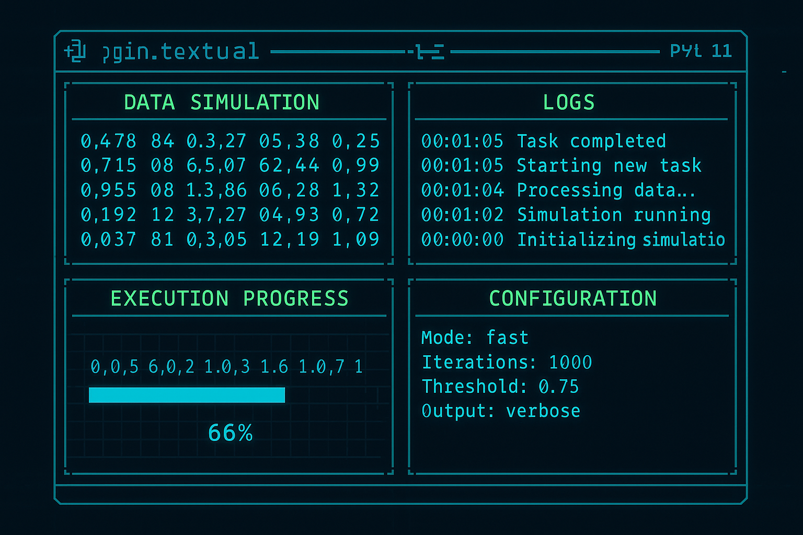
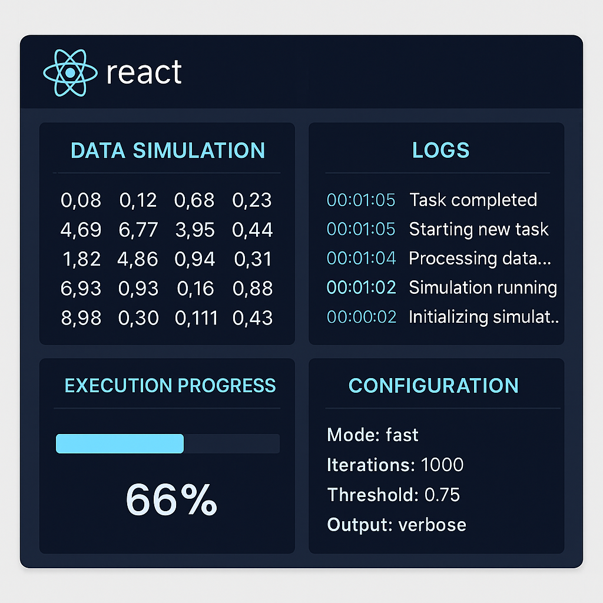

# CLAUDE.md

This file provides guidance to Claude Code (claude.ai/code) when working with code in this repository.

## Project Overview

Fake Sphere is a CLI and WebUI, synthetic data engine that simulates real-world data interactions across diverse systems. 
The project consists of:

- **Main application**: Located in `m2_fake_sphere/` - a Python package using Poetry for dependency management
- **Core functionality**: Database schema inspection and synthetic data generation, with initial focus on PostgreSQL

## Development Commands

### Python Package (m2_fake_sphere/)

```bash
# Navigate to Python package
cd m2_fake_sphere

# Install dependencies
poetry install

# Run the application
poetry run python -m m2_fake_sphere.db_postgres.main

# Run tests
poetry run pytest

# Format code
poetry run black .

# Check dependencies
poetry check
```

## Architecture

#### Key Design Patterns

- **Connection Pooling**: Uses psycopg2 connection pools for efficient database resource management
- **Circular Reference Prevention**: Configurable depth limits prevent infinite loops in relationship mapping  
- **Modular Pipeline**: Each component has a single responsibility and can be tested independently
- **Security**: Database passwords are never saved to configuration files

### API Traffic Simulation

**API Simulation Data Flow:**
```
Configuration → Read Swagger → Create API Request (w/ Faker Data) → API Call → Read Response → Log Response and Metrics → Loop back to Create API Request until complete the input amount  
```

#### Steps:
### **1. Initial Configuration**
Collect user inputs:
- **Simulation Name**: Unique identifier for the session
- **API Source**: Swagger/OpenAPI URL or local YAML/JSON file path
- **Environment**: Target environment (dev, staging, production)
- **Authentication**: JWT tokens, API keys, session credentials, or auth endpoints
- **Metrics Output**: Local directory path or database connection details
    - If database: host, port, credentials, certificates

### **2. Swagger Analysis**
- Parse the Swagger/OpenAPI specification
- Extract all endpoints, request/response schemas, and parameter definitions
- Identify required vs. optional fields and data types

### **3. Data Generation Mapping**
- **Auto-generate** YAML configuration mapping Swagger fields to Faker functions
- **Fuzzy match** API parameter names to appropriate Faker attributes
- **Flag uncertain mappings** (< 80% confidence) as "???" for user review
- **Present configuration** to user for confirmation and manual adjustments

### **4. Simulation Execution**
- **Generate control file** for thread coordination and progress tracking
- **Create synthetic requests** using Faker based on the finalized configuration
- **Handle authentication** by generating/refreshing tokens as needed per Swagger specs
- **Execute API calls** according to the defined endpoints and methods

### **5. Metrics Collection**
Capture comprehensive JSON metrics for each request:
- **Timing**: Request start/end timestamps and elapsed response time
- **Response data**: HTTP status code and response message
- **Request details**: Target host, URL, and port information

### **6. Progress Monitoring**
- **Check control file** continuously for pending transactions
- **Provide real-time updates**: Percentage completion and current status
- **Display final metrics** when simulation completes

This streamlined process ensures efficient API simulation with comprehensive monitoring and user control throughout the execution.

### Database Synthetic Data Ingestion

**Database Feed Data Flow:**
```
Configuration → Connection → Schema Discovery → Relationship Mapping → JSON Generation → Database Insert 
```

The Database Synthetic data ingestion dynamically generates synthetic data and ingest it into the database. The data is 
generated based on the Faker library and a configuration generated by the user. The column and table mapping to Faker's 
functions to create the Synthetic data is based on reading the DB metadata, based on user's input like database name, 
schema(s) and even table(s) of interest. The configuration is created based on the table structure, including foreign 
keys, constraints and other factors.

#### Steps
#### **1. Get Configuration from User**
Collect the following information interactively:
- **Simulation Name**: Unique identifier for this data ingestion session
- **Database Connection Details**:
    - Database Type (PostgreSQL, MySQL, SQLite, etc.)
    - Host, Port, Database Name
    - Username/Password or connection string
    - SSL/Certificate requirements

- **Target Environment**: Development, Staging, Production
- **Data Generation Scope**:
    - Specific tables to populate (or all tables)
    - Number of records per table
    - Data generation strategy (incremental, full refresh, append)

- **Output & Monitoring**:
    - Metrics output directory or database
    - Log level and destination
    - Real-time monitoring preferences

#### **2. Database Schema Discovery**
- Connect to the target database using connection pooling
- Extract complete schema metadata from `information_schema`
- Identify all tables, columns, data types, constraints
- Discover primary keys, foreign keys, and unique constraints
- Map table relationships and dependency hierarchy
- Detect circular references and handle them appropriately

#### **3. Schema Analysis & Relationship Mapping**
- Build a dependency graph of table relationships
- Determine optimal insertion order to respect foreign key constraints
- Identify data patterns and constraints:
    - Check constraints and validation rules
    - Enum values and allowed ranges
    - Default values and auto-increment fields

- Analyze existing data (if any) to understand patterns

#### **4. Create Data Generation Configuration**
Generate a YAML configuration file with:
- **Table-by-table mapping** of columns to Faker functions
- **Fuzzy matching** between column names and appropriate Faker attributes
- **Relationship preservation** rules for foreign keys
- **Data volume specifications** per table
- **Custom data patterns** for domain-specific fields
- **Constraint handling** for check constraints and validations

**Fuzzy Matching Process**:
- Match database column names to Faker function attributes
- Use similarity scoring (e.g., 80% threshold)
- Flag low-confidence matches as "???" for user confirmation
- Allow manual override and custom mappings

#### **5. User Confirmation & Customization**
Present the generated configuration to the user:
- Show proposed Faker mappings for each column
- Highlight uncertain mappings (< 80% confidence) for review
- Allow user to modify, approve, or provide custom generators
- Save finalized configuration for reuse

#### **6. Control File Generation**
When user is ready to start ingestion:
- Create a **Control File** accessible by all threads
- Include progress tracking, error handling, and coordination data
- Set up monitoring endpoints for real-time status updates

#### **7. Synthetic Data Generation**
For each table in dependency order:
- **Generate data** using Faker based on the configuration
- **Maintain referential integrity** by tracking generated foreign key values
- **Respect constraints** including unique keys, check constraints, and data types
- **Handle special cases** like auto-increment fields and computed columns
- **Batch generation** for optimal memory usage

#### **8. Database Insertion**
- **Prepare batch inserts** with appropriate transaction handling
- **Execute inserts** in dependency order to maintain referential integrity
- **Handle errors gracefully** with rollback capabilities
- **Track insertion metrics** including timing and success rates
- **Provide progress updates** to the control file

#### **9. Metrics Collection**
Generate comprehensive metrics as JSON with attributes:
- **Performance Metrics**:
    - Start and end timestamps per table
    - Records inserted per second
    - Database connection pool utilization
    - Memory usage during generation

- **Data Quality Metrics**:
    - Foreign key constraint violations (should be zero)
    - Data type conversion errors
    - Constraint validation failures

- **System Metrics**:
    - Database host and connection details
    - Total records generated per table
    - Transaction commit/rollback counts
    - Error rates and types

#### **10. Progress Monitoring & Control**
- **Check control file** continuously for status updates
- **Real-time progress reporting**:
    - Percentage completion per table and overall
    - Current insertion rate (records/second)
    - Estimated time remaining
    - Error count and recent error messages

- **Dynamic control**:
    - Ability to pause/resume ingestion
    - Emergency stop functionality
    - Rate limiting adjustments

#### **11. Completion & Reporting**
When ingestion is complete:
- **Final metrics summary**:
    - Total records inserted across all tables
    - Overall execution time
    - Average insertion rates
    - Final referential integrity validation

- **Data validation**:
    - Count verification per table
    - Constraint compliance check
    - Sample data quality review

- **Cleanup**:
    - Close database connections
    - Archive logs and metrics
    - Update control file status

### Key Differences from API Simulation:
1. **Relationship Awareness**: Database ingestion must respect foreign key relationships and insertion order
2. **Constraint Handling**: Must validate against database constraints, data types, and business rules
3. **Transaction Management**: Batch processing with proper transaction boundaries and rollback capabilities
4. **Schema-Driven**: Configuration is generated from actual database schema rather than Swagger definitions
5. **Referential Integrity**: Must maintain consistency across related tables during parallel insertion

This approach provides a robust, monitored, and user-friendly database data ingestion process that parallels your API simulation methodology while addressing the unique challenges of relational data generation.


## User Interface

### CLI

A modern CLI that serves to configure, control and monitor API Simulation or Database data ingestion. The CLI is very 
 modern in look and feel. Using Python Textual library, it can accommodate and simulate screens inside the terminal to 
monitor different aspects of the simulation, like Status, Logs, configuration, metrics in real-time, etc.

Example of the CLI layout. But in essence, it is like this.


### React JS WebApp
A modern react web app with futuristic in look and feel, but modern and simple at the same time. It can perform multiple 
tasks, like monitoring current simulations or data ingestion, metrics in real-time based on 1 or multiple simulations. Logs 
are printed in real-time in the webapp, and also, search for pass simulations. Also, manage configurations and 
integrations.

example of the react webpage, but very simplified


The web page will contain much more information. Also, it will react to screen re-size and events.

## Directory and Module Structure
```
fake-sphere/
├── .git/
├── .idea/
├── .claude/
├── assets/
├── docs/
├── LICENSE
├── README.md
├── .gitignore
├── CLAUDE.md
│
├── m2_fake_sphere/                    # Main Python package (Core Backend)
│   ├── src/
│   │   └── m2_fake_sphere/
│   │       ├── __init__.py
│   │       ├── core/                  # Core business logic
│   │       │   ├── __init__.py
│   │       │   ├── config/
│   │       │   ├── data_generation/
│   │       │   └── utils/
│   │       ├── db_postgres/           # Database functionality
│   │       │   ├── __init__.py
│   │       │   ├── configuration_manager.py
│   │       │   ├── database_connection_manager.py
│   │       │   ├── schema_inspector.py
│   │       │   ├── relationship_mapper.py
│   │       │   ├── json_structure_builder.py
│   │       │   └── main.py
│   │       ├── api_simulation/        # API traffic simulation
│   │       │   ├── __init__.py
│   │       │   ├── swagger_parser.py
│   │       │   ├── request_generator.py
│   │       │   ├── metrics_collector.py
│   │       │   └── simulation_engine.py
│   │       ├── ml_engine/             # Future LLM/ML functionality
│   │       │   ├── __init__.py
│   │       │   ├── phi2_fine_tuning.py
│   │       │   └── agent_simulation.py
│   │       └── integrations/          # External integrations
│   │           ├── __init__.py
│   │           ├── databases/
│   │           ├── apis/
│   │           └── streaming/
│   ├── tests/
│   ├── pyproject.toml
│   ├── poetry.lock
│   └── README.md
│
├── interfaces/                        # UI and CLI interfaces (separate from core)
│   ├── cli/                          # Terminal-native CLI using Python Textual
│   │   ├── __init__.py
│   │   ├── main.py
│   │   ├── screens/
│   │   │   ├── __init__.py
│   │   │   ├── dashboard.py
│   │   │   ├── configuration.py
│   │   │   ├── monitoring.py
│   │   │   ├── logs.py
│   │   │   └── metrics.py
│   │   ├── components/
│   │   │   ├── __init__.py
│   │   │   ├── status_widgets.py
│   │   │   ├── progress_bars.py
│   │   │   └── data_tables.py
│   │   └── utils/
│   │       ├── __init__.py
│   │       └── cli_helpers.py
│   │
│   ├── webapp/                       # React.js web interface
│   │   ├── public/
│   │   │   ├── index.html
│   │   │   ├── favicon.ico
│   │   │   └── manifest.json
│   │   ├── src/
│   │   │   ├── components/
│   │   │   │   ├── Dashboard/
│   │   │   │   ├── Monitoring/
│   │   │   │   ├── Configuration/
│   │   │   │   ├── Metrics/
│   │   │   │   ├── Logs/
│   │   │   │   └── Common/
│   │   │   ├── pages/
│   │   │   │   ├── Home.jsx
│   │   │   │   ├── Simulations.jsx
│   │   │   │   ├── Settings.jsx
│   │   │   │   └── History.jsx
│   │   │   ├── services/
│   │   │   │   ├── api.js
│   │   │   │   ├── websocket.js
│   │   │   │   └── auth.js
│   │   │   ├── hooks/
│   │   │   ├── utils/
│   │   │   ├── styles/
│   │   │   ├── App.jsx
│   │   │   └── index.js
│   │   ├── package.json
│   │   ├── package-lock.json
│   │   └── README.md
│   │
│   └── api_server/                   # Backend API server for web interface
│       ├── __init__.py
│       ├── main.py
│       ├── routes/
│       │   ├── __init__.py
│       │   ├── simulations.py
│       │   ├── metrics.py
│       │   ├── configurations.py
│       │   └── auth.py
│       ├── middleware/
│       ├── models/
│       └── websockets/
│
├── configs/                          # Configuration files
│   ├── default.yaml
│   ├── development.yaml
│   ├── production.yaml
│   └── templates/
│       ├── database_config.yaml
│       └── api_simulation_config.yaml
│
├── data/                            # Data storage
│   ├── simulations/
│   │   ├── active/
│   │   ├── completed/
│   │   └── templates/
│   ├── metrics/
│   ├── logs/
│   └── exports/
│
├── scripts/                         # Utility and deployment scripts
│   ├── install.sh
│   ├── setup_dev.sh
│   ├── deploy.sh
│   └── backup.sh
│
└── docker/                          # Containerization
    ├── Dockerfile.core
    ├── Dockerfile.webapp
    ├── docker-compose.yml
    └── docker-compose.dev.yml
```

## Tech-stack
- Python
  - CLI
  - Engine
  - Faker Data Generation
  - Thread Control
  - Control File
  - Backend API with Flask for CLI and WebUI to communicate.
  - WebSocket or Webhook calls to provide the information.
- ReactJS
  - WebApp
  - Webhooks or WebSockets to receive real-time push information
## Dependencies

Core libraries:
- **torch**: ML framework for future LLM integration
- **transformers**: Hugging Face transformers for Phi-2 model fine-tuning
- **faker**: Basic synthetic data generation
- **psycopg2-binary**: PostgreSQL database connectivity

## Future Architecture Components

The project roadmap includes:
- **LLM Fine-tuning**: Phi-2 model with QLoRA for intelligent data generation
- **Multi-target Support**: APIs, streaming platforms, files beyond databases
- **Agent Simulation**: Behavioral modeling for complex data interactions